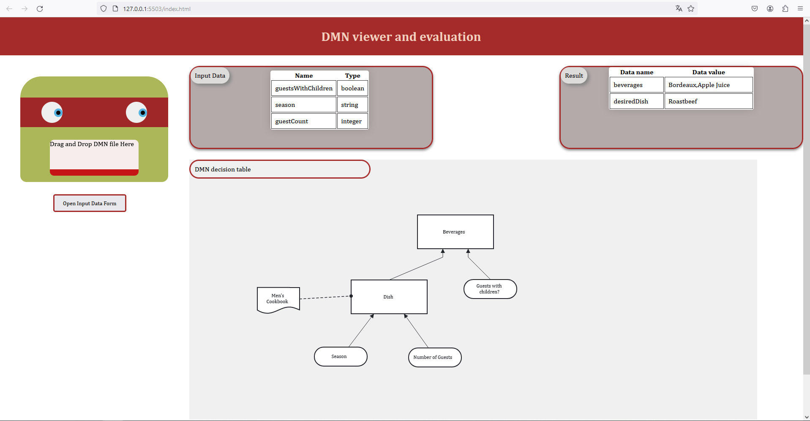

# DMN Project

## DMN Viewer and Evaluation Tool

This project provides a web-based interface for viewing and evaluating DMN (Decision Model and Notation) files. Users can drag and drop a DMN file onto the interface to view the decision table and input data. The tool also allows for the evaluation of decision logic against provided inputs.

### Features

- Drag and Drop DMN file upload
- Migration of DMN files 1.1/1.2 to 1.3 if necessary
- Display of DMN decision tables
- Evaluation of decision logic
- Interactive elements with CSS animations

### Dependencies

- npm

### Installation

To set up the project locally, follow these steps:

1. Clone the repository to your local machine.
2. Navigate to the project directory.
3. Install the necessary dependencies using `npm install`.
4. Build the project using `npm run build`.

### Usage

To use the tool:

1. Open `index.html` with a live server in a modern web browser.
2. Drag and drop a DMN file onto the designated area.
3. View the decision table and input data.
4. Evaluate decision logic by providing inputs or using the provided form, observing the output.

To generate documentation:

1. Navigate to the project directory.
2. Run `npm run doc`.
3. Open `docs/index.html` in a modern web browser.

### Acknowledgments

- Created by [C21111222](https://github.com/C21111222)

For more information on DMN and its usage, refer to the [DMN specification](https://www.omg.org/spec/DMN/).

---
