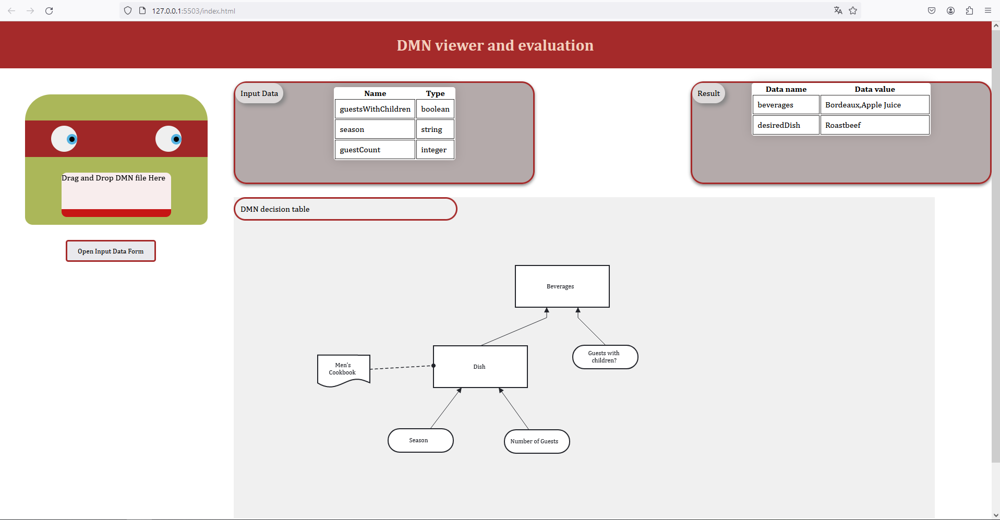

# Introduction
The goal of this project was to be able to display and evaluate a DMN file. This report explains the project's architecture as well as the design choices, main features, and libraries used to achieve these objectives. The source code is also available here [C21111222/DMN_project](https://github.com/C21111222/DMN_project).

# Code Organization
## Folder Structure
The project consists of several folders and subfolders, following this structure:

- `ts/`: Folder containing all TypeScript files.
  - `animation/`: Page animation functions (for example, `eyes_movements`)
  - `models/`: Data model classes (for example, `DMNModel`)
  - `utils/`: Utility functions and classes (for example, `migrate_DMN`)
  - `view/`: Classes and functions for data display (for example, `DataDisplay`)
  - `main.ts`: Main project file, importing various functions and data, handling file drag-and-drop.
- `css/`: Folder for CSS files
- `@types/`: Folder for TypeScript type declarations needed for the build
- `DMN_files`: Folder containing example DMN files

## Naming Convention
- **File**: snake_case (for example, `decision_table.ts`).
- **Classes & Interfaces**: PascalCase (for example, `DMNModel`).
- **Methods & Variables**: camelCase (for example, `defineInputData`).
- **Constants**: UPPER_SNAKE_CASE (for example, `MAX_TIMEOUT`).

## Detail of Classes and Functions
The details of the classes, their methods, and the project's functions can be found in the documentation. Refer to the associated section in "Installation and Usage".

# Code Synergy

The synergy between the different code components is essential to ensure a satisfactory user experience and easy maintenance of the project. Here is how the different parts of the code interact:

- **Interaction between models and view**: The classes in `ts/models/` define the structure of the DMN data and their business logic. When a DMN file is loaded, these models are instantiated and populated with the file's data. Then, `ts/view/` takes these models and visually renders them in the browser, allowing users to interact with the data intuitively.

- **Utilities and models**: The functions in `ts/utils/` provide several common services such as the migration of DMN files (`migrate_DMN`) which is used by the model classes to ensure that the DMN files are in the correct format before being processed.

- **Animations and user interactions**: The `ts/animation/` folder contains scripts that enhance the user interface with animations.

- **Event management**: `main.ts` acts as the conductor, listening for drag-and-drop events and coordinating actions between models, views, and utilities. It ensures that DMN files are correctly loaded and that the data is displayed without delay.

This synergy is designed to be modular, with each part of the code having a clear responsibility, which facilitates updates and the addition of new features.

# Libraries and Frameworks
The project relies on several libraries to function:
- **DMN-JS**: Groups JavaScript objects to "read" DMN files.
- **SweetAlert2**: Allows simple display of notifications.
- **Xmldom**: Allows parsing of XML files.
- **DMN-Migrate**: I used this library ([GitHub link](https://github.com/bpmn-io/dmn-migrate)) by adapting it to TypeScript, allowing the migration of DMN files to version 1.3 from earlier versions.
- **Feelin**: Allows the evaluation of FEEL language expressions, which correspond to the rules in a DMN file.
- **TypeDoc**: Allows the generation of documentation.

# General Operation
The principle of the application is simple: drag and drop a DMN file. This allows you to visualize and evaluate it. Then, you can observe the output data.

## Additional Features
- **Migration**: Thanks to the DMN-Migrate library, the application can handle DMN files in versions 1.1 and 1.2.
- **Visualization of sub-tables**: When the DMN file contains multiple decisions, the display corresponds to all of them. To view the sub-tables in detail, you can click on the object representing them in the diagram.
- **Form**: To evaluate a DMN file, you can either drop a JSON file containing the required data or use the automatically generated form by clicking on "Open Input Data Form".
- **Documentation**: The generation of documentation for each file is available in the "Documentation" section.

# Installation and Usage

## Prerequisites
- **npm (Node Package Manager)**: Node.js's package manager is necessary for downloading dependencies and building the application.
- **Live Server**: A local server is required to open the project's HTML file.

## Build
1. (from GitHub only) Clone the repository.
2. Navigate to the project directory.
3. Install the necessary dependencies by running npm install.
4. Build the project by running npm run build.

## Usage
1. Open index.html with a local server in a modern web browser.
2. Drag and drop a DMN file into the designated area.
3. Review the decision table and input data.
4. Evaluate the decision logic by providing a JSON file or using the provided form.
5. Observe the output.

## Documentation
1. Navigate to the project directory.
2. Run npm run doc.
3. Open docs/index.html in a web browser.

# Limitations
Several areas can be improved in this project:
- Incomplete error handling.
- Support for aberrant DMN files, for example, a file containing multiple unrelated decisions (such as flight rebooking).
- Code robustness.